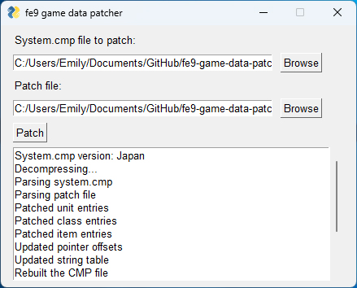
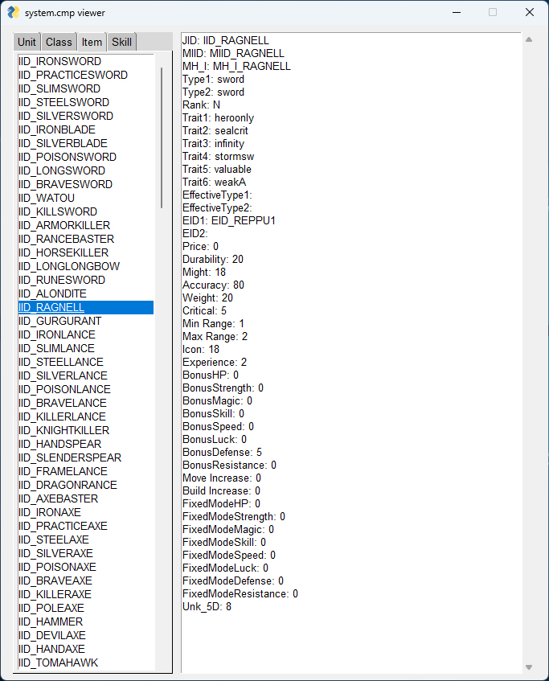

A quick tool I made to modify FE8Data.bin in Fire Emblem: Path of Radiance

There's also a viewer that displays the data in FE8Data.bin

## Installing Dependencies
Download the repository

In the command line, navigate to the root directory

Install the dependencies  
`pip3 install -r requirements.txt`

Install setuptools  
`pip3 install setuptools`

Navigate to ./fe9LZ77module

Build the module  
`python3 setup.py install`
