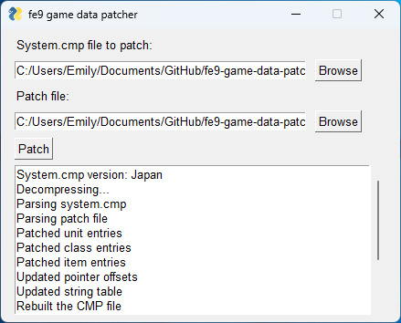
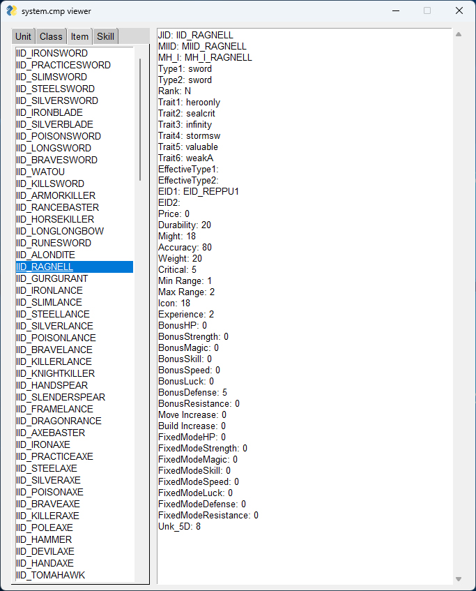

A quick tool I made to modify FE8Data.bin in Fire Emblem: Path of Radiance



There's also a viewer that displays the data in FE8Data.bin



## Setup
1. Navigate terminal to project folder
2. Run these commands:

```
py install 3.14.3
py -V:3.14.3 -m venv venv
venv\Scripts\activate
pip install -r requirements.txt
pip install setuptools
cd fe9LZ77module
python3 setup.py install
```

Launch with patcher.bat and viewer.bat
